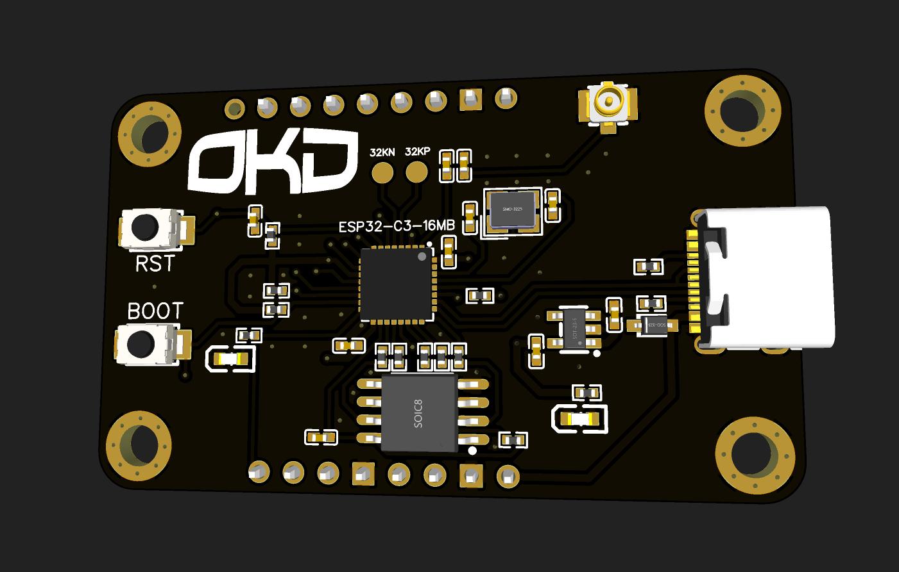

# OKD Nova ESP32-C3 16MB Development Board

By Carsen Klock

Welcome to the OKD Nova ESP32-C3 16MB Development Board repository! This open-source project provides all the necessary files and information for the development board based on the ESP32-C3 microcontroller with custom 16MB of external NOR flash memory.

## Repository Structure

- `/PCB`: Contains PCB design files for both EasyEDA and Altium
- `/Schematic`: Contains schematic diagrams for both EasyEDA and Altium
- Gerber, BOM, and pick and place files are located in the root of the repository.

## Supported Software

This project supports multiple PCB design software to cater to different user preferences:

1. EasyEDA: A free, web-based PCB design tool.
2. Altium Designer: A professional PCB design software.

## Features

- ESP32-C3 RISC-V microcontroller (Supports Wifi, Bluetooth, Hardware Encryption, True Random Number)
- 16MB of external NOR flash (QSPI)
- USB-C connector for power and programming
- Onboard WiFi/BT, SMA connector for antenna
- Multiple GPIO pins exposed
- RESET and BOOT buttons
- 2x LEDs
- Compact form factor

## Getting Started

1. Clone this repository
2. Open the PCB or schematic files using your preferred software (EasyEDA or Altium Designer)

## Contributing

We welcome contributions to improve the OKD Nova ESP32-C3 16MB Development Board! Please feel free to submit issues, feature requests, or pull requests.

## License

This project is open-source and available under the [MIT License](LICENSE).
